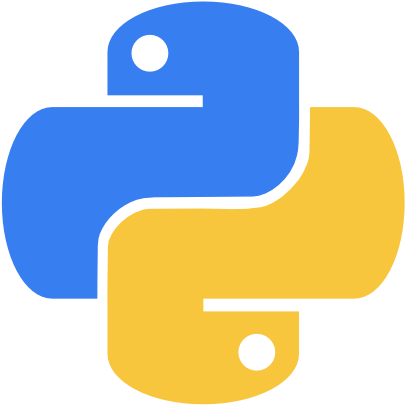

  

<h1 align="center">Python Practice Repository</h1>

  A comprehensive collection of Python practice problems, coding exercises, notes, solutions, and mini-projects designed to strengthen Python programming skills from beginner to advanced levels.

This repository serves as a structured learning resource covering Python fundamentals, problem-solving techniques, object-oriented programming, file handling, error handling, automation, and practical projects.

Whether you're starting your Python journey, strengthening your fundamentals, or revising advanced concepts, this repository provides clear explanations, organized examples, and hands-on practice.

## Features

* Beginner to Advanced Python Concepts
* Practice Problems & Coding Exercises
* Well-Explained Solutions
* Concept Notes and Examples
* Mini Projects
* Organized Folder Structure
* Problem-Solving Practice
* Regular Updates and Improvements

> **Note:** This repository is continuously maintained and expanded with new exercises, projects, and learning resources over time.
